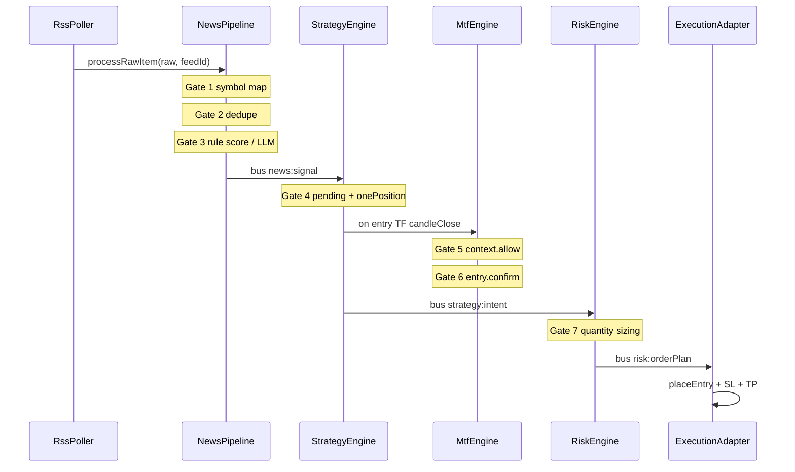

# Entry Path — Crypto News Auto-Trader

**Analysis date:** 2026-05-25

## Live pipeline (`start`)

### Step-by-step (with files)

| Step | Trigger | Module | Config / condition | Early exit |
|------|---------|--------|-------------------|------------|
| 1 | RSS poll tick | `src/news/rss-poller.ts`, `src/news/rss-poller-manager.ts` | `feeds[].enabled`, `pollIntervalSec` | Feed disabled / fetch error |
| 2 | Raw item | `src/news/normalizer.ts` | — | — |
| 3 | Symbol map | `src/news/symbol-mapper.ts` | `symbols` whitelist | **Exit:** `news.symbols.length === 0` |
| 4 | Dedupe | `src/news/dedupe.ts` | SQLite `news` | **Exit:** duplicate `news.id` |
| 5 | Persist raw | `src/storage/repositories/news-repo.ts` | — | — |
| 6 | Rule score | `src/sentiment/rule-scorer.ts` | `sentiment.rules.*`, `minStrength`, keywords | **Exit:** discard or null score |
| 7 | LLM (optional) | `src/sentiment/llm-gateway.ts` | `sentiment.llm.enabled`, `thresholdLLM`, `OPENROUTER_API_KEY` | Skipped if not `needsLlm` |
| 8 | Merge signal | `src/sentiment/signal-merger.ts` | `minConfidence` (LLM) | **Exit:** null signal |
| 9 | Store + emit | `src/sentiment/news-pipeline.ts` | — | `bus.emit('news:signal')` |
| 10 | Queue signal | `src/strategy/strategy-engine.ts` | `strategy.onePositionPerSymbol` | **Exit:** paused; already has position |
| 11 | Pending store | `src/strategy/pending-signals.ts` | TTL / expiry | — |
| 12 | Candle close | `src/market/binance-market.ts` → WS | Only `timeframes.entry` (default `4h`) | Wrong TF ignored |
| 13 | Wait rule | `src/strategy/strategy-engine.ts` | `strategy.entry.waitForNextCandleClose` | **Exit:** signal received same bar |
| 14 | MTF context | `src/strategy/mtf-engine.ts` | `timeframes.context` (`1d`), Elliott/Fib in `config/default.yaml` | **Exit:** `!context.allow` |
| 15 | MTF entry | `src/strategy/mtf-engine.ts` | swing / fib / ATR bands | **Exit:** `!entry.confirm` |
| 16 | Intent | `src/strategy/strategy-engine.ts` | — | `bus.emit('strategy:intent')` |
| 17 | Risk plan | `src/risk/risk-engine.ts` | `risk.positionPercent`, SL/TP ATR mult | **Exit:** quantity too small |
| 18 | Execute | `src/app/bootstrap.ts` `handleOrderPlan` | mode `sim`/`testnet`/`live` | Adapter errors logged |
| 19 | Persist trade | `src/storage/repositories/trade-repo.ts` | on fill / close events | — |

**Wiring:** `src/app/bootstrap.ts` creates bus, repos, `NewsPipeline`, `StrategyEngine`, `RiskEngine`, `createAdapter()`.

---

## Backtest pipeline (`backtest`)

| Step | Module | Notes |
|------|--------|-------|
| 1 | `src/cli/commands/backtest.ts` | Parses `--from`, `--to`, optional `--mock-sentiment` |
| 2 | `src/execution/backtest-replayer.ts` | Loads `news_signals` from SQLite **or** synthetic mock signals |
| 3 | Klines | `src/market/kline-cache.ts` — cache under `data/klines/`, may download from Binance REST |
| 4 | Replay | Replays candle closes on timeline; same `StrategyEngine`, `MtfEngine`, `RiskEngine`, `SimBroker` |
| 5 | Report | JSON metrics: `totalTrades`, `wins`, `losses`, `winRate`, `totalPnlUsdt`, `maxDrawdownPct` |

### `--mock-sentiment` behavior

- Generates alternating long/short `NewsSignal` every **6 hours** per symbol (`generateMockSignals` in `backtest-replayer.ts`).
- **Does not** exercise RSS, rule scorer, or LLM.
- Use for **strategy/MTF/risk** baseline only.

### Without mock

- Requires existing rows in `news_signals` for date range (from prior `start` / sim).
- Error: `No news_signals in date range. Run sim first or pass --mock-sentiment.`

---

## Live vs backtest differences

| Aspect | Live (`start`) | Backtest |
|--------|----------------|----------|
| News source | RSS pollers | DB signals or mock generator |
| Sentiment gates | Full rule + optional LLM | Only if real signals in DB |
| Market data | Live WS + REST | Cached/downloaded klines |
| Execution | sim / testnet / live adapter | `SimBroker` only |
| Time | Real-time | Simulated `simNow` per bar |
| Pause | `src/core/pause-flag.ts` | N/A |

**Parity risks (Phase 9):** mock sentiment bypasses gates 3–8; live LLM latency; WS gaps vs cached bars; `waitForNextCandleClose` timing.

---

## Entry gate checklist (manual review)

For each closed trade, confirm what was true at entry:

1. [ ] News mapped to symbol in `config.symbols`
2. [ ] Rule score passed (`minStrength`, not blacklisted)
3. [ ] If LLM used: confidence ≥ `sentiment.llm.minConfidence`
4. [ ] No open position on symbol (`onePositionPerSymbol`)
5. [ ] Pending signal not expired
6. [ ] Entry on `timeframes.entry` candle close (not context TF only)
7. [ ] `waitForNextCandleClose` satisfied (signal from prior bar)
8. [ ] MTF context allowed (`mtf.evaluateContext`)
9. [ ] MTF entry confirmed (`mtf.evaluateEntry` — Fib zone, swing, ATR band)
10. [ ] Risk sized quantity ≥ min notional
11. [ ] SL/TP placed with entry

Record failures in `failure_category` on review CSV (see `01-METRICS-SCHEMA.md`).
