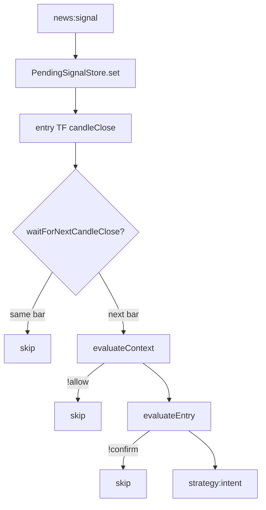

# MTF Entry Rules

**Analysis date:** 2026-05-25  
**Code:** `src/strategy/mtf-engine.ts`, `src/strategy/strategy-engine.ts`, `src/strategy/pending-signals.ts`

## Flow (after `news:signal`)

## Context gate — `MtfEngine.evaluateContext`

**File:** `src/strategy/mtf-engine.ts` (lines 44–98)  
**Timeframe:** `config.timeframes.context` (default `1d`)

| Check | Config | Reject reason |
|-------|--------|---------------|
| Min bars | `swing.lookback`, `swing.minSwingCount` | `insufficient_context_data` |
| Swing count | `swing.minSwingCount` | `insufficient_swings` |
| Trend vs direction | Elliott `detectWaveTrend` | `elliott_context_conflict` |
| Impulse required | `elliott.contextRequireImpulse: true` | `elliott_sideways_blocked` / weak |
| Sideways market | `elliott.allowSideways: false` | `elliott_sideways_blocked` |
| Weak sideways pass | `sentiment.rules.strongNewsThreshold` (0.75) | `elliott_sideways_weak` |

**Default behavior (`contextRequireImpulse: false`):** Allow if trend matches direction; if sideways, only allow when `signal.strength >= strongNewsThreshold`.

## Entry gate — `MtfEngine.evaluateEntry`

**File:** `src/strategy/mtf-engine.ts` (lines 101–212)  
**Timeframe:** `config.timeframes.entry` (default `4h`)  
**Constants:** `MIN_RISK_REWARD = 1.5` (hardcoded)

| Check | Config | Reject reason |
|-------|--------|---------------|
| Min bars / ATR | `atrPeriod`, swing params | `insufficient_entry_data` / `insufficient_atr` |
| Volatility floor | `minAtrPercent` (0.12) | `atr_below_minimum` |
| Volatility cap | `maxAtrPercent` (3.5) | `atr_above_maximum` |
| Swings | `swing.lookback` | `insufficient_swings` |
| Impulse leg | `minImpulsePercent` (80) | `no_matching_impulse_leg` |
| Fib retrace | `entryMin` 0.382, `entryMax` 0.618, `zoneTolerancePercent` 0.05 | `outside_fib_zone` |
| R:R | stop `stopLevel` 0.886, TP `targetExtension` 1.618 | `risk_reward_too_low` |

## Strategy engine — `StrategyEngine`

**File:** `src/strategy/strategy-engine.ts`

| Behavior | Config | Lines |
|----------|--------|-------|
| Queue on signal | — | 33–46 |
| One position per symbol | `onePositionPerSymbol: true` | 39–44, 65–70 |
| Only entry TF closes | `timeframes.entry` | 54–56 |
| Expire pending | `signal.expiresAt` via `pending.pruneExpired` | 58, `pending-signals.ts` 31–36 |
| Wait next candle | `entry.waitForNextCandleClose: true` | 75–78 |
| Context then entry | `mtf.evaluateContext` → `mtf.evaluateEntry` | 81–93 |

**Note:** Failed context/entry checks return silently (no log reason in strategy engine). Use backtest logging or future telemetry for reject reasons.

## Config reference (defaults)

| Key | Default | Affects |
|-----|---------|---------|
| `timeframes.context` | `1d` | Context candles |
| `timeframes.entry` | `4h` | Entry candle + pending evaluation |
| `strategy.atrPeriod` | 14 | Entry ATR |
| `strategy.minAtrPercent` | 0.12 | Min volatility |
| `strategy.maxAtrPercent` | 3.5 | Max volatility |
| `strategy.entry.waitForNextCandleClose` | `true` | Same-bar block |
| `strategy.onePositionPerSymbol` | `true` | Duplicate entries |
| `strategy.swing.lookback` | 3 | Swing detection |
| `strategy.swing.minSwingCount` | 5 | Context + entry swings |
| `strategy.swing.minImpulsePercent` | 80 | Impulse leg quality |
| `strategy.elliott.allowSideways` | `false` | Sideways entries |
| `strategy.elliott.contextRequireImpulse` | `false` | Strict impulse on context |
| `strategy.fibonacci.entryMin/Max` | 0.382 / 0.618 | Retrace zone |
| `strategy.fibonacci.zoneTolerancePercent` | 0.05 | Zone width |
| `strategy.fibonacci.stopLevel` | 0.886 | SL fib |
| `strategy.fibonacci.targetExtension` | 1.618 | TP fib |
| `sentiment.rules.strongNewsThreshold` | 0.75 | Sideways context bypass |

## Gaps (not in code)

| Item | Status |
|------|--------|
| Explicit “confirm rules” beyond Fib/Elliott | Not separate module — all in `mtf-engine.ts` |
| Per-symbol cooldown after loss | **Not implemented** |
| MTF reject reason logging in backtest | **Not implemented** — silent returns |
| Entry quality score / setup_quality in backtest trades | DB field exists; backtest `BacktestTradeRecord` minimal |
| Phase 3 compound test (sentiment + MTF) | Deferred to Phase 6 |

## Baseline reference

| Run | mockSentiment | totalTrades | winRate |
|-----|---------------|-------------|---------|
| Phase 1 `baseline-backtest.json` | true | 25 | 0.32 |

Phase 3 fixture-seeded real signals: **2 trades** — not comparable to mock MTF baseline.
