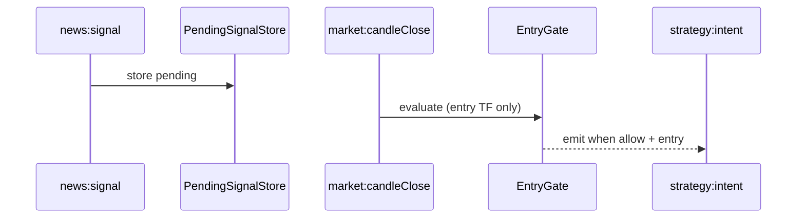

# Entry Gates Design (Phase 6)

## Scope

Phase 6 gates cover the **MTF technical path** only: Elliott context on the higher timeframe, then Fib/swing entry on the lower timeframe. Sentiment filtering stays in `NewsPipeline` / `SignalMerger`; Phase 6 merges the Phase 3 preset (`sentiment.llm.enabled: false`) into `config/default.yaml`.

Per-symbol cooldown after a loss is **out of scope** → Phase 7.

## Interface

```typescript
type EntryGateResult = {
  allow: boolean;
  reason?: string;
  stage?: 'context' | 'entry';
  entry?: MtfEntryResult; // SL/TP/atr when allow
};
```

`EntryGate.evaluate(symbol, direction, strength)` wraps `MtfEngine.evaluateContext` then `evaluateEntry`.

## Flow



1. `StrategyEngine` receives `news:signal` → pending per symbol.
2. On **entry timeframe** `candleClose`, pending signal is evaluated.
3. `EntryGate` runs context then entry checks.
4. On success, `strategy:intent` → `RiskEngine` → `risk:orderPlan`.

## Logging

When `entryGates.logRejects: true`, rejects log at **info** with `{ symbol, direction, reason, stage }`.

Default production: `logRejects: false` (quiet logs).

## Escape hatch

`entryGates.enabled: false` skips context and only runs `evaluateEntry` (tests / debugging).

## Implementation

| File | Role |
|------|------|
| `src/strategy/entry-gate.ts` | `EntryGate` class |
| `src/strategy/strategy-engine.ts` | Calls `EntryGate` instead of inline MTF |
| `src/config/schema.ts` | `entryGates` Zod section |
| `config/default.yaml` | Production toggles |

## Behavior change vs pre-Phase 6

Merges from research (not the wrapper itself):

- `sentiment.llm.enabled: false`
- `strategy.fibonacci.zoneTolerancePercent: 0.02`
- 5-symbol universe (Phase 5)
