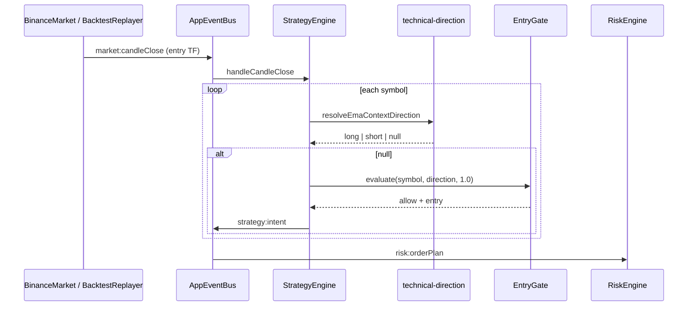

# Technical Trigger Mode (No News) — Design Specification

| Field | Value |
|-------|-------|
| **Document ID** | `2026-05-25-technical-trigger-mode-design` |
| **Status** | Approved (brainstorming) — ready for implementation plan |
| **Parent spec** | `2026-05-20-crypto-news-trader-design` |
| **Brainstorming choices** | Trigger on entry candle close; direction from EMA context (15m); flat → skip; disable RSS/NewsPipeline; all modes (`sim`, `testnet`, `live`, `backtest`) |
| **Version** | 1.0 |

---

## 1. Summary

Add **`strategy.triggerMode`** with values **`news`** (default, current behavior) and **`technical`**.

When **`technical`**:

- **No RSS polling** and **no `NewsPipeline`** at runtime (saves CPU/network).
- On each **`market:candleClose`** for the **entry timeframe**, scan **every symbol** in `config.symbols`.
- **Direction** is derived from **EMA fast/slow on the context timeframe** (same math as `EmaTrendContextGate`): `fast > slow` → long, `fast < slow` → short, **flat or insufficient data → skip symbol**.
- **Entry timing** uses existing **`EntryGate`** + intraday paths (`breakout`, `emaMomentum`) with a fixed **`strength` of `1.0`**.
- **`waitForNextCandleClose`** is **ignored** in technical mode (no prior news arrival).
- Trade intents use synthetic metadata: `newsId: 'technical'`, `newsSignalId: 'technical-{symbol}-{timestamp}'`.
- Applies uniformly to **`sim`**, **`testnet`**, **`live`**, and **`backtest`** when config says so.

This turns the bot into a **multi-timeframe technical trader** while preserving the shared execution stack (risk → adapter / sim broker).

---

## 2. Goals & Non-Goals

### 2.1 Goals

- Allow live/testnet/sim/backtest **without depending on RSS or `news_signals`**
- Single config flag for mode parity across execution surfaces
- Reuse **existing** context EMA settings (`strategy.profiles.intraday.contextEma`) and entry paths
- Reuse **`EmaTrendContextGate`** alignment logic via a shared direction resolver (no drift vs gate)
- Backtest without `seed-signals` or `--mock-sentiment` when `triggerMode: technical`
- Clear audit trail in DB/reports (`newsId === 'technical'`)

### 2.2 Non-Goals (v1)

- **Hybrid** mode (news OR technical on same run)
- **Direction from entry path** (option B in brainstorming) — future `directionSource` if needed
- **Per-mode overrides** (e.g. technical only on live) — one global `triggerMode` per config file
- Disabling **`entryGates`** automatically in technical mode
- New indicators or YAML-defined rules beyond existing intraday profile
- Changing **`swing`** / Fib-primary profile behavior for technical (warn only if `entryProfile: swing` + `technical`)
- RSS “poll but ignore” (brainstorming rejected — full disable)

---

## 3. Decisions Log

| Topic | Decision |
|-------|----------|
| Config key | `strategy.triggerMode: 'news' \| 'technical'` (default `'news'`) |
| Trigger | Every entry-TF `market:candleClose` → all `config.symbols` |
| Direction | EMA context TF (`timeframes.context`): fast > slow → long, fast < slow → short |
| Flat | `\|fast - slow\| / close < flatPercent` → skip symbol (no trade) |
| RSS / pipeline | Not started when `technical` |
| Scope | All runtime modes + backtest replayer |
| `waitForNextCandleClose` | Ignored when `technical` |
| `strength` passed to gate | Fixed `1.0` |
| Intent `newsId` / `newsSignalId` | `'technical'` / `'technical-{symbol}-{iso}'` |
| Backtest signals DB | Not required; `--mock-sentiment` ignored with warning |

---

## 4. Configuration

### 4.1 Schema (`src/config/schema.ts`)

```yaml
strategy:
  triggerMode: news   # news | technical  (default: news)
  # ... existing strategy keys unchanged
```

- Zod: `z.enum(['news', 'technical']).default('news')`
- Default in `config/default.yaml`: `news`
- Example operator profile (`config/production.yaml` comment block only until validated):

```yaml
strategy:
  triggerMode: technical
  entryProfile: intraday
  # context 15m + entry 5m — required for EMA direction + intraday paths
```

### 4.2 Load-time warnings (`profile-warnings.ts`)

Emit **warn** (non-fatal) when:

| Condition | Message intent |
|-----------|----------------|
| `triggerMode === 'technical'` && `entryProfile === 'swing'` | Technical mode optimized for intraday; swing/fib-primary may rarely trade |
| `triggerMode === 'technical'` && all `feeds[].enabled: true` | Feeds ignored in technical mode — disable feeds to avoid confusion |

Do **not** auto-flip `entryProfile` or `feeds`.

### 4.3 Unchanged config (still used in technical mode)

| Block | Role |
|-------|------|
| `timeframes.context` / `entry` | EMA direction on context; entry paths on entry |
| `strategy.profiles.intraday.contextEma` | fast/slow periods, `flatPercent` |
| `strategy.alternateEntries.*` | breakout / emaMomentum evaluators |
| `entryGates.*` | Context + entry filtering (unchanged) |
| `risk.*`, `binance.*`, `sim.*` | Execution sizing and broker |
| `feeds`, `sentiment` | Ignored at runtime when `technical`; kept for switching back to `news` |

---

## 5. Runtime Behavior

### 5.1 Mode comparison

| Aspect | `news` (default) | `technical` |
|--------|------------------|-------------|
| RSS / `NewsPipeline` | Started | **Not created / not started** |
| `news:signal` handler | Sets `PendingSignalStore` | **No-op** (handler not registered or early return) |
| Entry candle close | Symbols **with pending** signal only | **All** `config.symbols` |
| Direction source | News signal | `resolveEmaContextDirection()` |
| `waitForNextCandleClose` | Enforced | **Skipped** |
| DB `news_signals` | Live pipeline / seed | Not required |

### 5.2 Technical evaluation flow

```text
ON market:candleClose WHERE tf === timeframes.entry:
  IF paused → return
  IF triggerMode !== 'technical' → existing news pending flow

  FOR symbol IN config.symbols:
    IF cooldown(symbol) → continue
    IF onePositionPerSymbol AND hasPosition(symbol) → continue

    direction = resolveEmaContextDirection(symbol, store, config)
    IF direction IS NULL → continue   // flat or insufficient 15m bars

    gate = entryGate.evaluate(symbol, direction, strength=1.0)
    IF !gate.allow → continue (optional gate reject capture)

    BUILD TradeIntent:
      newsId = 'technical'
      newsSignalId = 'technical-{symbol}-{iso}'
      side from direction
      entry from gate.entry
    EMIT strategy:intent
```

### 5.3 Direction resolver

**New module:** `src/strategy/technical-direction.ts`

```ts
export function resolveEmaContextDirection(
  symbol: string,
  store: KlineStore,
  config: AppConfig,
): SignalDirection | null
```

**Rules** (must match `EmaTrendContextGate` for non-flat cases):

1. Read candles for `config.timeframes.context`.
2. Use `config.strategy.profiles.intraday.contextEma` (`fastPeriod`, `slowPeriod`, `flatPercent`).
3. Require `candles.length >= slowPeriod + 5` (same as gate).
4. Compute EMA fast/slow on closes; `close = last close`.
5. If `|fast - slow| / close < flatPercent` → return `null`.
6. If `fast > slow` → `'long'`; if `fast < slow` → `'short'`.
7. If NaN / undefined → `null`.

**Note:** When `entryProfile !== 'intraday'`, resolver should still use intraday `contextEma` if present, or document that technical mode **requires** `entryProfile: intraday` (enforce via load warning; v1 does not hard-fail).

**Refactor option (recommended):** Extract shared `computeEmaTrendState(symbol, store, config) → { direction, isFlat, reason? }` used by both `EmaTrendContextGate` and resolver to prevent formula drift.

### 5.4 Interaction with `EntryGate`

With `entryGates.enabled: true` and `entryProfile: intraday`:

1. **Context stage:** `EmaTrendContextGate` checks news direction vs EMA — with `strength = 1.0` and direction **from** EMA, non-flat cases should **allow** (long + fast > slow, short + fast < slow).
2. **Entry stage:** `breakout` / `emaMomentum` run as today with the resolved direction.

Flat symbols never reach the gate (skipped at resolver).

### 5.5 `StrategyEngine` changes (`src/strategy/strategy-engine.ts`)

- Branch at start of `handleCandleClose` on `config.strategy.triggerMode`.
- Extract `evaluateTechnicalSymbol(symbol, event)` private method.
- Keep `handleNewsSignal` unchanged for `news` mode; for `technical`, either omit listener registration or no-op at top.

**Do not** use `PendingSignalStore` in technical mode (no TTL/expiry semantics needed).

---

## 6. Bootstrap & Runtime Context

### 6.1 `wireTradingStack` (`src/app/bootstrap.ts`)

```text
IF config.strategy.triggerMode === 'news':
  create NewsPipeline, RssPollerManager, rssManager.start()

IF config.strategy.triggerMode === 'technical':
  skip pipeline + RSS entirely
  rssManager = undefined (or NoopRssManager with start()/stop() no-op)
```

### 6.2 `RuntimeContext` (`src/app/runtime-context.ts`)

```ts
newsPipeline?: NewsPipeline;
rssManager?: RssPollerManager;
```

Shutdown handler must tolerate missing RSS manager.

### 6.3 `cli/news-stack.ts`

Unaffected — used by standalone news CLI commands, not main trading bootstrap.

---

## 7. Backtest

### 7.1 `backtest-replayer.ts`

When `config.strategy.triggerMode === 'technical'`:

- **Do not** load `news_signals` from DB for replay.
- **Do not** require `--mock-sentiment` or seeded signals.
- If `mockSentiment: true` passed → **log warn** and ignore mock.
- Replay loop unchanged: emit `market:candleClose` per entry bar; `StrategyEngine` handles technical scan.

### 7.2 CLI (`src/cli/commands/backtest.ts`)

- Update help text: technical mode needs klines only.
- Error message `No news_signals in date range` **only** when `triggerMode === 'news'` and no signals/mock.

### 7.3 Experiment matrix (optional follow-up)

Add `config/experiments/backtest-technical-matrix.yaml`:

```yaml
# Example — adjust to repo matrix runner conventions
configs:
  - config/production.yaml
    overrides:
      strategy.triggerMode: technical
```

---

## 8. Data & Observability

### 8.1 Trade / intent metadata

| Field | Value (technical) |
|-------|-------------------|
| `newsId` | `'technical'` |
| `newsSignalId` | `'technical-BTCUSDT-2026-05-25T12:05:00.000Z'` (ISO of evaluation time) |
| `entryPath` | From gate (`breakout`, `emaMomentum`, etc.) |

SQLite `trades` columns remain nullable-compatible; filters: `WHERE news_id = 'technical'`.

### 8.2 Logging

On each entry candle close (debug/info, configurable):

- `technical_scan` with symbol count evaluated, intents emitted, skips by reason (`flat`, `gate_reject`, `cooldown`, `has_position`).

### 8.3 Metrics (future)

Count gate rejects with `stage: context|entry` under technical mode for tuning `flatPercent` and entry paths.

---

## 9. Architecture

### 9.1 Module layout

```text
src/strategy/
  strategy-engine.ts          # branch: news vs technical on candle close
  technical-direction.ts      # NEW: resolveEmaContextDirection (+ shared EMA state optional)
  context/
    ema-trend-context-gate.ts # optional refactor: shared EMA state helper
```

### 9.2 Event diagram



---

## 10. Testing

### 10.1 Unit tests

| File | Cases |
|------|--------|
| `tests/unit/technical-direction.test.ts` | long, short, flat, insufficient bars, NaN |
| `tests/unit/strategy-engine-technical.test.ts` | emits intent on synthetic klines; skips flat; respects cooldown mock |

### 10.2 Integration tests

| Test | Assertion |
|------|-----------|
| `backtest-smoke` variant or new `backtest-technical-smoke.test.ts` | `triggerMode: technical`, cached BTC klines, `totalTrades >= 0` (prefer > 0 over known window) |
| `mode-parity-replay` extension | Same config technical: sim paper stack vs backtest replayer intent count within tolerance OR document deterministic single-path |

### 10.3 Manual verification

1. `triggerMode: technical` in `config/default.yaml` copy / experiment YAML.
2. `npm run dev -- backtest --from ... --to ...` without seed/mock.
3. `npm run dev -- start --mode sim` — confirm logs show no RSS poll, intents with `newsId: technical`.

---

## 11. Documentation Updates (implementation phase)

| Doc | Change |
|-----|--------|
| `docs/LENH-THAM-CHIEU.md` | `strategy.triggerMode`, backtest without seed |
| `docs/HUONG-DAN-FUTURES.md` | Section “Bot thuần kỹ thuật (không tin)” |
| `docs/BACKTEST-SAT-LIVE.md` | Contrast news-realistic vs technical backtest |
| `README.md` | One paragraph + config table row |
| `config/default.yaml` | `triggerMode: news` + comment |
| `config/production.yaml` | Commented example `# triggerMode: technical` |

---

## 12. Risks & Mitigations

| Risk | Mitigation |
|------|------------|
| More trades / overtrading vs news mode | Document; operator lowers `positionPercent` or enables `cooldownAfterLoss` |
| EMA resolver vs gate drift | Shared helper refactor |
| `swing` profile + technical | Load warning |
| Operator enables `mock-sentiment` by habit | CLI warn + ignore |
| Live without news edge | `LIVE-SAFETY-CHECKLIST` add bullet: confirm `triggerMode` intentional |

---

## 13. Implementation Checklist (for plan writer)

- [ ] Schema + defaults + `profile-warnings`
- [ ] `technical-direction.ts` (+ optional EMA shared helper)
- [ ] `StrategyEngine` technical branch
- [ ] `bootstrap.ts` conditional RSS/pipeline
- [ ] `RuntimeContext` optional news types + shutdown
- [ ] `backtest-replayer.ts` + CLI messages
- [ ] Unit + integration tests
- [ ] Docs listed in §11
- [ ] Parity note in `docs/MODE-PARITY.md` if applicable

---

## 14. Open Questions (deferred)

| ID | Question | Default if unresolved |
|----|----------|------------------------|
| OQ-1 | Hard-fail config when `technical` + `entryProfile: swing`? | Warn only |
| OQ-2 | Export `directionSource: emaContext` sub-key for future option B? | Omit in v1 |
| OQ-3 | Per-symbol `triggerMode` override? | No |

---

## 15. Approval Record

| Role | Status | Date |
|------|--------|------|
| Product / operator (user) | Approved via brainstorming | 2026-05-25 |
| Design sections 1–4 | Approved | 2026-05-25 |
| Engineering | Pending implementation plan | — |
