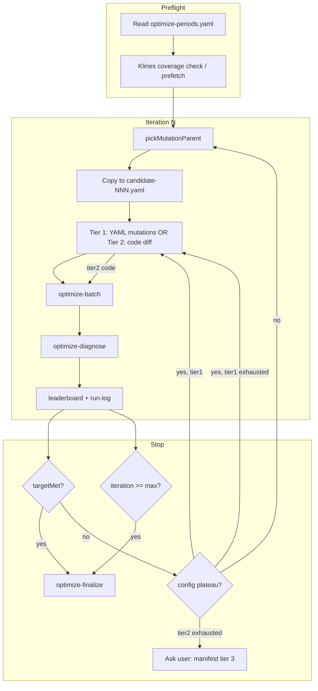

# Strategy Optimize Skill v2 — Design Specification

| Field | Value |
|-------|-------|
| **Document ID** | `2026-05-29-optimize-strategy-skill-v2-design` |
| **Status** | Approved (brainstorming 2026-05-29) — ready for implementation plan |
| **Supersedes** | Extends `2026-05-27-strategy-optimize-skill-design.md` (v1); v1 remains valid for scoring model and file layout |
| **Parent spec** | `2026-05-20-crypto-news-trader-design` |
| **Related** | `scripts/optimize-batch.ts`, `scripts/optimize-finalize.ts`, `scripts/lib/optimize-scoring.ts`, `.cursor/skills/optimize-strategy/`, `.cursor/skills/optimize-strategy-loop/` |
| **Brainstorming scope** | Full: CONFIG tier + CODE tier + MANIFEST tier (user-approved); script-assisted diagnosis; best-effort finalize; mandatory klines preflight |

---

## 1. Problem Statement

v1 shipped a working **config-mutation loop** (`optimize-batch` + skills) but production use exposed gaps:

| Symptom | Root cause |
|---------|------------|
| `totalTrades: 0` across periods | Kline cache date range did not cover manifest periods; skill did not **require** preflight |
| Agent “optimized” but target never approached | Mutations were heuristic-only; no structured diagnosis tying **which period** fails the win gate |
| `production.yaml` updated while `optimize-finalize` would fail | Agent manually copied best candidate when **no eligible** entry existed — bypasses spec |
| Win rate stuck ~51–53% with tight config | **Config-only search space exhausted**; skill had no escalation to strategy code |
| Loop wakes without state | `optimize-strategy-loop` payload lacked tier, gap-to-gate, parent candidate id |

**v2 goal:** Make the optimize loop **actually converge toward manifest targets** using every safe lever: better scripts, smarter parent selection, mandatory gates, code-tier changes when config plateaus, and user-approved manifest changes — without abandoning v1’s filter-then-rank scoring model.

---

## 2. Goals & Non-Goals

### 2.1 Goals

- Preserve v1 **scoring**: `eligible = min(period.winRate) >= minWinRate`; rank eligible by `totalPnlPercent`; `targetMet = eligible && totalPnlPercent >= targetPnlPercent`.
- Add **deterministic diagnosis** after each batch (`optimize-diagnose`) so the agent does not hand-parse large JSON reports every time.
- Add **mutation parent selection** that considers near-miss candidates (high `minWinRate`, not only eligible).
- Add **klines preflight gate** before trusting zero-trade results.
- Add **three-tier escalation**: CONFIG → CODE → MANIFEST (with human approval for tier 3).
- Fix **finalize** to support **best-effort promotion** when iterations exhaust but no one is eligible.
- Update skills with anti-patterns, tier checklists, and loop payloads.
- Record **report paths** on leaderboard entries for reproducible diagnosis.

### 2.2 Non-Goals (v2)

- Automated grid search / Optuna / Bayesian optimization.
- Changing denylist keys (`mode`, `allowLive`, Binance URLs, storage, feeds, `sentiment.llm`).
- Live or testnet trading during optimize.
- Automatic git commit of winner or spec files.
- Parallel multi-candidate backtests on multiple cores.
- Guaranteed attainment of arbitrary targets (e.g. 60% win on all periods) — v2 improves process; operator may still need realistic targets.

---

## 3. Architecture Overview



**Hybrid model (unchanged):** scripts run backtests + scoring; agent (or loop wake) applies mutations. v2 adds scripts for **diagnosis**, **parent pick**, **plateau detection**, and **finalize best-effort**.

---

## 4. Scoring & Leaderboard (v1 retained + extensions)

### 4.1 Core formulas (unchanged)

```
totalPnlUsdt    = sum(period.totalPnlUsdt)
totalPnlPercent = (totalPnlUsdt / sim.initialBalanceUsdt) * 100
minWinRate      = min(period.winRate * 100)   // report.winRate is 0–1
eligible        = minWinRate >= targets.minWinRate
targetMet       = eligible && totalPnlPercent >= targets.targetPnlPercent
```

### 4.2 Leaderboard extensions

Each `LeaderboardEntry` adds optional fields:

| Field | Type | Description |
|-------|------|-------------|
| `reportPaths` | `string[]` | One backtest report path per manifest period (newest batch run) |
| `tier` | `'config' \| 'code'` | Last mutation tier used to produce this candidate |
| `promotedAs` | — | Set only on finalize copy, not on batch |

`LeaderboardFile.best` remains **best eligible** by `totalPnlPercent`. Add:

| Field | Type | Description |
|-------|------|-------------|
| `bestNearEligible` | `{ candidateId, minWinRate, totalPnlPercent }` | Highest `minWinRate` among ineligible (tie-break `totalPnlPercent`) |
| `bestPnl` | `{ candidateId, totalPnlPercent, eligible }` | Highest `totalPnlPercent` regardless of eligibility |

### 4.3 Mutation parent selection (new lib API)

`pickMutationParent(entries, seedConfigPath): { configPath, reason }`

Priority:

1. **Eligible:** highest `totalPnlPercent` among `eligible === true`.
2. **Near gate:** highest `minWinRate` among ineligible (tie-break `totalPnlPercent`).
3. **Seed:** `manifest.seedConfig`.

**Never** default to `seedConfig` when a later candidate improved `minWinRate` or `totalPnlPercent` unless operator resets leaderboard.

---

## 5. Scripts

### 5.1 `scripts/optimize-diagnose.ts` (new)

**Purpose:** Machine-readable bottleneck analysis for the agent and loop payload.

**CLI:**

```bash
npm run optimize-diagnose -- \
  --manifest config/optimize-periods.yaml \
  --candidate-id candidate-005
# or
npm run optimize-diagnose -- --report data/reports/backtest-....json --report data/reports/backtest-....json
```

| Flag | Required | Description |
|------|----------|-------------|
| `--manifest` | no* | Load periods + targets |
| `--candidate-id` | no* | Read `reportPaths` from leaderboard entry |
| `--report` | no* | Repeatable; overrides leaderboard paths |
| `--config` | no | Candidate config (for symbol list) |

\* One of: (`--candidate-id` + leaderboard) or at least one `--report`.

**Output (stdout JSON):**

```json
{
  "klinesOk": true,
  "klinesWarning": null,
  "targets": { "minWinRate": 60, "targetPnlPercent": 60 },
  "aggregate": {
    "totalPnlUsdt": 64.63,
    "totalPnlPercent": 10.77,
    "minWinRate": 51.11,
    "eligible": false,
    "gapWinRatePoints": 8.89,
    "gapPnlPercentPoints": 49.23
  },
  "weakestPeriod": {
    "from": "2025-10-01",
    "to": "2025-12-31",
    "winRate": 51.11,
    "totalPnlUsdt": 4.0,
    "totalTrades": 45
  },
  "perPeriod": [ "..." ],
  "gateRejectTop": [
    { "reason": "ema_slope_weak", "count": 120, "stage": "entry" }
  ],
  "symbolPnl": { "BTCUSDT": 12.5, "ETHUSDT": -8.2 },
  "suggestedTier": "config",
  "suggestedMutations": [
    {
      "path": "risk.tpAtrMultiplier",
      "direction": "decrease",
      "rationale": "Raise win rate on weakest period; tighter TP"
    }
  ],
  "plateau": { "detected": false, "iterationsCompared": 3 }
}
```

**`klinesOk` logic:**

- For each symbol in candidate config and each timeframe (`context`, `entry`), load cache file.
- Verify cache spans `[min(period.from) - warmup, max(period.to)]` (same warmup as `prefetch-klines`: 200 bars).
- If not: `klinesOk: false`, `klinesWarning` with exact prefetch command.

**`suggestedMutations`:** Rule-based mapping from diagnosis (reuse v1 reference heuristics); cap at **3** items; prefer actions for **weakestPeriod** when win rate is the binding constraint.

**`plateau`:** Call `isPlateau(run-log.jsonl, window=3, metric='minWinRate', epsilon=1.0)` from scoring lib.

**Exit code:** `0` always if parse succeeds; `1` on missing files.

### 5.2 `scripts/optimize-batch.ts` (modify)

- After each `runBacktest`, capture written report path (return from `runBacktest` or scan `reportDir` — **implementation must pick one deterministic approach**).
- Store `reportPaths` on leaderboard entry.
- Optional flag `--diagnose` → invoke diagnose internally and print diagnose JSON after summary (second line) for agent convenience.

### 5.3 `scripts/lib/optimize-scoring.ts` (modify)

Add exports:

```ts
export const pickMutationParent = (
  entries: LeaderboardEntry[],
  seedConfigPath: string,
): { configPath: string; candidateId?: string; reason: string };

export const pickBestEffortEntry = (
  entries: LeaderboardEntry[],
): LeaderboardEntry | undefined;
// Order: eligible by totalPnlPercent DESC; else ineligible by minWinRate DESC, totalPnlPercent DESC

export const isPlateau = (
  runLogLines: Array<{ minWinRate: number; totalPnlPercent: number }>,
  window: number,
  metric: 'minWinRate' | 'totalPnlPercent',
  epsilon: number,
): boolean;

export const buildLeaderboardFile = (...): LeaderboardFile;
// Populate best, bestNearEligible, bestPnl
```

### 5.4 `scripts/optimize-finalize.ts` (modify)

Replace `pickBestEntry`-only logic:

| Step | Action |
|------|--------|
| 1 | `best = pickBestEntry(entries)` |
| 2 | If missing: `best = pickBestEffortEntry(entries)` |
| 3 | If still missing: `reason: 'leaderboard_empty'` |
| 4 | Copy `best.configPath` → `manifest.baseConfig` |
| 5 | Set `promotedAs: 'eligible' \| 'near_miss'`; `targetMet` only if eligible && PnL target met |

**Finalize result type extension:**

```ts
export type FinalizeResult = {
  promoted: boolean;
  reason:
    | 'target_met'
    | 'best_effort_cap'
    | 'best_effort_near_miss'
    | 'no_eligible_candidate'
    | 'leaderboard_missing'
    | 'leaderboard_empty';
  promotedAs?: 'eligible' | 'near_miss';
  candidateId?: string;
  configPath?: string;
  totalPnlPercent?: number;
  minWinRate?: number;
  targetMet?: boolean;
};
```

| `reason` | `production.yaml` | User message |
|----------|-------------------|--------------|
| `target_met` | Updated | Success |
| `best_effort_cap` | Updated (eligible, PnL below target) | Warning: PnL target not met |
| `best_effort_near_miss` | Updated (best near-miss) | Warning: win gate not met; promoted best effort |
| `no_eligible_candidate` / `leaderboard_empty` | **Unchanged** | Failure |

**Anti-pattern (skill):** Agent must **not** `cp candidate → production.yaml` unless `optimize-finalize` succeeded or user explicitly requests manual override (log in chat).

### 5.5 `package.json` scripts (add)

```json
"optimize-diagnose": "tsx scripts/optimize-diagnose.ts"
```

---

## 6. Three-Tier Agent Model

### 6.1 Tier 1 — CONFIG (default)

**When:** Every iteration until config plateau or `targetMet`.

**Actions:**

- Copy `pickMutationParent` config → `config/optimize/candidate-{NNN}.yaml`.
- Apply **1–3** mutations from `reference.md` bounds; document rationale in chat.
- Respect `denylist` and `symbolPool`.
- Run `optimize-batch`; run `optimize-diagnose` (or `optimize-batch --diagnose`).

**Preflight (mandatory):**

```
- [ ] Read config/optimize-periods.yaml
- [ ] If first iteration OR prior batch had totalTrades==0 on any period:
      npm run prefetch-klines -- --config <candidate> --from <minPeriodFrom> --to <maxPeriodTo>
      (single span covering ALL manifest periods + warmup)
- [ ] optimize-diagnose must report klinesOk:true before interpreting winRate/PnL
```

### 6.2 Tier 2 — CODE (escalation)

**When (any):**

- `optimize-diagnose.plateau.detected === true` for **config-tier** iterations (`tier` absent or `config`) in last `plateauWindow` (default **3**), and
- `aggregate.gapWinRatePoints > 0` OR repeated zero-trade after klines OK, and
- `iteration < maxIterations` (optionally `iteration < maxIterations + maxCodeIterations` if manifest extended).

**Allowed change surface** (documented in `.cursor/skills/optimize-strategy/reference-code.md`):

| Area | Examples | Requires tests |
|------|----------|----------------|
| `src/strategy/entry-gate.ts` | Gate ordering, new reject reason | Yes |
| `src/strategy/context/*` | Context EMA gate tweaks | Yes |
| `src/strategy/entries/*` | Entry path evaluators (emaMomentum) | Yes |
| `src/strategy/mtf-engine.ts` | Minor filter hooks | Yes |
| `tests/unit/*`, `tests/integration/*` | New cases for changed gates | Yes |

**Forbidden:** `denylist` paths, live trading, unrelated refactors.

**Workflow:**

```
- [ ] Write 1–3 sentence hypothesis tied to diagnose output
- [ ] Implement minimal code change + unit test
- [ ] npm test -- <focused paths>
- [ ] Copy latest config parent → new candidate (tier: code)
- [ ] optimize-batch + diagnose
- [ ] Record tier:"code" on leaderboard entry
```

**Stop tier 2:** plateau on `minWinRate` for `codePlateauWindow` (default 2) code iterations → tier 3 proposal.

### 6.3 Tier 3 — MANIFEST (human in the loop)

**When:** Config plateau **and** code plateau (or operator rejects code changes), targets still not met.

**Agent must ask** (single structured question), never silently edit:

- Lower `targets.minWinRate`?
- Lower `targets.targetPnlPercent`?
- Add/remove/replace `periods[]`?
- Expand `symbolPool`?

On approval:

- Edit `config/optimize-periods.yaml`.
- Reset plateau counters in run-log note (append `{"event":"manifest_reset",...}`).
- Optionally clear leaderboard or fork new `optimize-run-id` (v2.1; default: keep leaderboard but append manifest hash change warning).

---

## 7. Skill Updates

### 7.1 `optimize-strategy/SKILL.md`

Replace workflow with:

```
## Preflight
- [ ] Read manifest + leaderboard + last 5 run-log lines
- [ ] Klines gate (prefetch if needed)
- [ ] If iteration > maxIterations → finalize

## Iteration
- [ ] parent = pickMutationParent (script or leaderboard fields)
- [ ] Determine tier (1 config / 2 code / 3 ask user)
- [ ] Create candidate-{NNN}.yaml (tier documented in commit message / chat)
- [ ] npm run optimize-batch [--diagnose]
- [ ] If diagnose.klinesOk === false → prefetch, re-batch, do not mutate params yet
- [ ] If targetMet → finalize
- [ ] Else plan next mutation from diagnose.suggestedMutations (don't invent scores)

## Anti-patterns
- Do NOT hand-edit production.yaml
- Do NOT mutate seed when a better parent exists on leaderboard
- Do NOT treat 0 trades as "bad config" before klinesOk
```

Add sections: **Tier escalation**, **Finalize table** (v2 reasons), **Link reference-code.md**.

### 7.2 `optimize-strategy/reference.md`

- Align `slopeLookback` upper bound with observed use (3–10) or enforce 3–8 in diagnose suggestions only.
- Add **Gap-to-target table**:

| `gapWinRatePoints` | Priority actions |
|--------------------|------------------|
| > 10 | Tier 2 consideration; symbol prune; TP tighten + SL widen |
| 5–10 | minAtr↑, slopeLookback↑, flatPercent↑, BTC-only |
| < 5 | tp/sl fine-tune, cooldown |

### 7.3 `optimize-strategy/reference-code.md` (new)

- Allowed files list (§6.2).
- Test command templates.
- Example: add minimum RR check before entry allow.

### 7.4 `optimize-strategy-loop/SKILL.md`

**On arm wake**, payload must include:

```json
{
  "action": "continue",
  "iteration": 12,
  "tier": "config",
  "bestCandidateId": "candidate-005",
  "minWinRate": 51.1,
  "targetWinRate": 60,
  "totalPnlPercent": 10.77,
  "targetPnlPercent": 60,
  "plateau": true,
  "klinesOk": true
}
```

**Stop arming loop when:**

- `targetMet`, or
- `iteration >= maxIterations` and finalize has run, or
- Tier 3 waiting on user, or
- User says stop (kill sleeper PID).

**On `iteration >= maxIterations`:** run `optimize-finalize` **before** last wake (not optional).

---

## 8. Manifest Extensions (optional fields)

```yaml
targets:
  targetPnlPercent: 60
  minWinRate: 60
  maxIterations: 20
  maxCodeIterations: 5      # optional; default 0 = code tier uses maxIterations shared cap
  plateauWindow: 3          # optional; default 3
  plateauEpsilonWinRate: 1.0  # optional; percentage points
```

If `maxCodeIterations` is 0, tier 2 shares `maxIterations` budget.

---

## 9. File Tree (v2 deliverables)

```
scripts/
  optimize-diagnose.ts          # new
  optimize-batch.ts             # modify: reportPaths, --diagnose
  optimize-finalize.ts          # modify: best-effort
  lib/optimize-scoring.ts       # modify: parent, plateau, leaderboard meta
tests/unit/
  optimize-scoring.test.ts      # extend
  optimize-diagnose.test.ts     # new (fixture reports)
.cursor/skills/optimize-strategy/
  SKILL.md                      # rewrite workflow
  reference.md                  # gap table
  reference-code.md             # new
.cursor/skills/optimize-strategy-loop/
  SKILL.md                      # payload + stop rules
docs/superpowers/specs/
  2026-05-29-optimize-strategy-skill-v2-design.md   # this file
docs/superpowers/plans/
  2026-05-29-optimize-strategy-skill-v2.md        # from writing-plans skill
docs/LENH-THAM-CHIEU.md         # add optimize-diagnose
```

---

## 10. Acceptance Criteria

1. **Klines gate:** With empty/wrong cache, diagnose returns `klinesOk: false` and prefetch command; skill doc lists preflight.
2. **Diagnose:** Given last batch reports, stdout JSON includes `weakestPeriod`, `gateRejectTop`, `suggestedMutations` (≤3).
3. **Parent pick:** After candidate-002 beats seed on `minWinRate`, iteration 3 copies candidate-002, not seed.
4. **Plateau:** Three iterations with `minWinRate` within 1pt triggers `plateau.detected` and skill tier-2 path.
5. **Finalize near-miss:** No eligible entries but candidate-005 has highest `minWinRate` → finalize copies it with `promotedAs: near_miss`.
6. **targetMet path:** Eligible + PnL ≥ target → `target_met`, production updated.
7. **Loop payload:** Loop skill documents required JSON fields; agent on wake reads diagnose + leaderboard.
8. **Tests:** Unit tests for `pickMutationParent`, `pickBestEffortEntry`, `isPlateau`, diagnose rules on fixture JSON.
9. **No manual production copy** in skill anti-patterns section.

---

## 11. Risks & Mitigations

| Risk | Mitigation |
|------|------------|
| Code tier breaks live behavior | Unit tests required; denylist unchanged; sim-only |
| Best-effort promote unsafe config | Log `near_miss`; operator reviews diff before live |
| Overfit | Tier 3 + skill text: rotate periods; hold-out dates |
| Diagnose rules wrong | suggestedMutations are hints; agent may override with justification |
| Kline cache overwrite | Prefetch once spanning all periods (document in skill) |
| Long loop cost | `maxIterations` + plateau early tier 3 ask |

---

## 12. Decisions Log (v2)

| Topic | Decision |
|-------|----------|
| Scoring model | Unchanged from v1 |
| Config-only default | Tier 1; tier 2 when plateau |
| Code changes | Allowed with tests + reference-code.md |
| Manifest changes | User approval only (tier 3) |
| Finalize without eligible | Best-effort `near_miss` allowed |
| Diagnosis | New script, mandatory after batch |
| Parent selection | Eligible → near-miss → seed |
| v1 spec | Not deleted; v2 extends §7 agent loop |

---

## 13. Next Steps

1. Operator reviews this spec (`docs/superpowers/specs/2026-05-29-optimize-strategy-skill-v2-design.md`).
2. Invoke **writing-plans** → `docs/superpowers/plans/2026-05-29-optimize-strategy-skill-v2.md`.
3. Implement in order: scoring lib → diagnose script → batch/finalize → tests → skills → dry-run 3+ iterations including plateau path.

---

## 14. Spec Self-Review

| Check | Result |
|-------|--------|
| Placeholders | None |
| Consistency with v1 | Scoring and file paths aligned |
| Scope | Skills + scripts; no Optuna |
| Ambiguity | `runBacktest` must expose report path — **implementation task** in plan |
| User approval | Tier 3 manifest changes require explicit ask |
